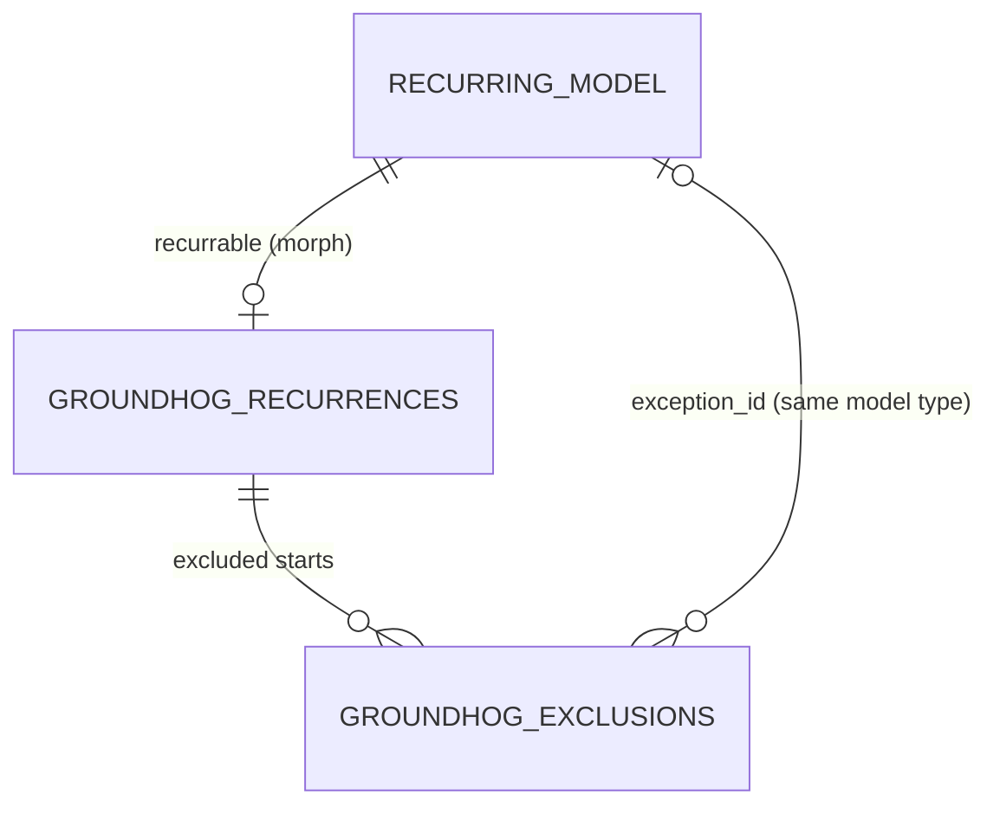

# Data Model: Groundhog — Recurring Eloquent Models

Two package tables plus the application's own recurring-model table. Key column types for
`recurrable_id` and `exception_id` follow Laravel's default morph key type
(`Schema::morphUsingUuids()` / `morphUsingUlids()`), so joins against the model's primary key
compare equal types on every supported database.



## Recurring model record (application table, e.g. `meetings`)

Owned by the application. The package adds no columns.

| Concern | Rule |
|---|---|
| Start column | `RECURRENCE_STARTS_AT` constant, default `starts_at`. Datetime, required for series. |
| End column | `RECURRENCE_ENDS_AT` constant, default `ends_at`; `null` = model has no end. |
| Role | Derived, never stored: **plain** (no recurrence, no exclusion link), **series** (has a `groundhog_recurrences` row), **exception** (referenced by `groundhog_exclusions.exception_id`). |

Query-time identity attributes (present on rows returned through the occurrence scope, and on
stored rows loaded through `RecurringBuilder` without it, where they are resolved in one query per
result set; never written):

| Attribute | Plain | Series* | Virtual occurrence | Exception |
|---|---|---|---|---|
| primary key | own | own | `null` | own |
| `groundhog_series_key` | `null` | `null` (stored-row loads) | series key | series key |
| `groundhog_original_starts_at` | `null` | `null` (stored-row loads) | occurrence start | replaced start |
| `exists` | true | true | **false** | true |

\* Series rows never appear in expanded results; they are reachable by key (FR-015) or
`withoutOccurrences()`.

## `groundhog_recurrences` — the rule (FR-003)

| Column | Type | Notes |
|---|---|---|
| `id` | bigIncrements | |
| `recurrable_type`, `recurrable_id` | `morphs()` | unique pair: one rule per series |
| `rule` | text | RFC 5545 text from `RRule::rfcString()`, incl. `DTSTART;TZID=` |
| `timezone` | string(64) | IANA zone the rule is evaluated in |
| `is_infinite` | boolean | cached `RRule::isInfinite()`, selects the horizon cap during generation |
| `created_at`, `updated_at` | timestamps | |

Validation (on assignment, before any write; FR-006):
- Input parses with `new RRule(...)`; any `InvalidArgumentException` → `InvalidRecurrenceRule` with the parser message.
- Input yields an `RRule`, not an `RSet` (no EXDATE/RDATE lines).
- The owning record is not an exception (`RecurrenceNotSupported`).
- The model's start attribute is non-null when saving (`RecurrenceNotSupported`).
- A finite rule's total occurrence count is ≤ `groundhog.max_occurrences_per_series` (`OccurrenceLimitExceeded`), checked on save.
- An infinite rule's occurrences from DTSTART to `now + horizon` number ≤ `groundhog.max_occurrences_per_series` (`OccurrenceLimitExceeded`), checked on save.

Nothing derived from the rule is stored (FR-002). The 0.1 table `groundhog_occurrences` and column
`materialized_until` are dropped by `drop_groundhog_occurrence_index` (no-op on fresh installs).

## `groundhog_exclusions` — exceptions and cancellations

Spec terms: a row with `exception_id` is an *exception link*; a row without one is a
*cancellation*. `Index\ExceptionLedger` is the only class that writes this table. In PHP code
"exception" means an occurrence exception; thrown errors live in `Exceptions\` and are named after
the failure (`RecurrenceNotSupported::forOccurrenceException`).

| Column | Type | Notes |
|---|---|---|
| `id` | bigIncrements | |
| `recurrence_id` | foreignId → recurrences, `cascadeOnDelete` | |
| `original_starts_at` | datetime | the generated start being suppressed |
| `exception_id` | morph-key type, nullable | key of the replacing record (same model type); `null` = cancelled |
| `created_at`, `updated_at` | timestamps | |

Indexes: unique `(recurrence_id, original_starts_at)` (at most one exception per occurrence);
index `exception_id`.

## State transitions

```mermaid
stateDiagram-v2
    [*] --> Plain: create without rule
    [*] --> Series: create with recurrence_rule
    Plain --> Series: assign rule
    Series --> Plain: set rule null (exclusions reset, FR-022)
    Series --> Series: change rule text / start (exclusions reset)\nchange duration, other attrs or re-assign identical rule (no stored change beyond the series row)
    Series --> [*]: hard delete (rule, exclusions removed; exceptions force-deleted)
    Series --> Series: soft delete hides occurrences and exceptions; restore shows them

    state "Virtual occurrence" as Virtual
    Series --> Virtual: query expands
    Virtual --> Exception: save / update / increment (exclusion with exception_id)
    Virtual --> Cancelled: delete (exclusion, exception_id null)
    Exception --> Exception: save (in-place update)
    Exception --> Cancelled: hard delete (exception_id → null)
    Cancelled --> [*]: series rule/start changed (exclusion row deleted, FR-022)
    Exception --> Exception: soft delete hides row, link kept; restore shows it
    Exception --> Plain: series rule/start changed (exclusion row deleted; cancellations discarded too)
```

## Derived semantics (not stored)

- **Occurrence end**: `occurrence start + (series end − series start)`.
- **Horizon cap**: `(lower start bound ?? lower end bound ?? now) + groundhog.horizon`; applied
  only to infinite rules and only when the query has no upper bound on start/end.
- **Occurrences**: generated per query for the query's window and passed to SQL as one JSON
  parameter; each series generates at most `groundhog.max_occurrences_per_series` per query
  (`OccurrenceLimitExceeded`). Never stored (FR-002).
- **Occurrence identity**: `(groundhog_series_key, groundhog_original_starts_at)`; unique within a
  model type. `OccurrenceCollection` keys its dictionary by it.
