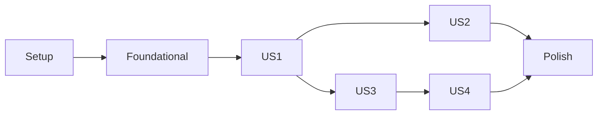

---

description: "Task list for Groundhog — Recurring Eloquent Models"
---

# Tasks: Groundhog — Recurring Eloquent Models

**Input**: Design documents from `/specs/001-recurring-eloquent-models/`

**Prerequisites**: [plan.md](plan.md), [spec.md](spec.md), [research.md](research.md), [data-model.md](data-model.md), [contracts/public-api.md](contracts/public-api.md), [contracts/query-semantics.md](contracts/query-semantics.md), [quickstart.md](quickstart.md)

**Tests**: REQUIRED. Constitution Principle II (non-negotiable) mandates acceptance tests derived from the spec's scenarios, written before implementation and failing first. Tests assert observable behaviour only (Principle III): query results, stored rows, thrown exceptions — never generated SQL text or private structure.

**Organization**: Tasks are grouped by user story. US2, US3 and US4 build on the query engine delivered by US1 (see Dependencies).

## Format: `[ID] [P?] [Story] Description`

- **[P]**: Can run in parallel (different files, no dependencies on incomplete tasks)
- **[Story]**: User story the task belongs to (US1–US4)
- Namespace root `BoysFromTheFactory\Groundhog` maps to `src/`; tests use Pest 4 on Orchestra Testbench 11.

## Conventions for every task

- Every public method documents inputs, outputs, thrown exceptions and invariants (Constitution I).
- Comments explain *why*, never *what*.
- Datetimes written to package tables use the recurring model's `fromDateTime()` (model date format, app timezone); see research R7.
- Clock-dependent tests use `$this->travelTo()`; tests never read the real clock.
- Spec references (US1-2, FR-017, …) in test names are encouraged so failures map to the spec.

---

## Phase 1: Setup (Shared Infrastructure)

**Purpose**: Turn the empty repository into a configured Laravel 13 package based on spatie/package-skeleton-laravel.

- [ ] T001 Scaffold the package into the repository root from `spatie/package-skeleton-laravel` (branch `main`): clone it to a temporary directory under `$HOME` (lerd cannot run PHP from `/tmp`), copy every file except `.git/` into the repo root without touching the existing `.git/`, `.specify/`, `.omp/` and `specs/`, then replace the placeholders exactly as `configure.php` would: vendor slug `boysfromthefactory`, vendor name `Boys From The Factory`, package slug `groundhog`, package name `Groundhog`, namespace `BoysFromTheFactory\Groundhog`, class prefix `Groundhog`, author `Balazs Sebesteny <sebestenybalazs@gmail.com>`, description `Declarative recurring Eloquent models backed by RFC 5545 rules.` Delete `configure.php` afterwards.
- [ ] T002 Update `composer.json`: `require` = `"php": "^8.4"`, `"illuminate/contracts": "^13.0"`, `"rlanvin/php-rrule": "^3.0"`, `"spatie/laravel-package-tools": "^1.16"`; `require-dev` = `orchestra/testbench ^11.0`, `pestphp/pest ^4.0`, `pestphp/pest-plugin-arch ^4.0`, `pestphp/pest-plugin-laravel ^4.0`, `larastan/larastan ^3.0`, `laravel/pint ^1.14`, `nunomaduro/collision ^8.8`, `phpstan/extension-installer ^1.4`, `phpstan/phpstan-deprecation-rules ^2.0`, `phpstan/phpstan-phpunit ^2.0`; remove `spatie/laravel-ray` (unused) and the facade alias under `extra.laravel.aliases`; add `"suggest": {"ext-intl": "Localised output for RRule::humanReadable()"}`; keep provider `BoysFromTheFactory\Groundhog\GroundhogServiceProvider`.
- [ ] T003 Delete skeleton example code that the package will not use (Constitution V): `src/Groundhog.php`, `src/Facades/`, `src/Commands/`, `resources/views/`, `tests/ExampleTest.php`, and the skeleton's sample `config` file contents and migration stub (replaced in Phase 2). Strip the command and view registration from `src/GroundhogServiceProvider.php`.
- [ ] T004 [P] Remove `composer.lock` from `.gitignore` so the lockfile is committed (Constitution: dependencies pinned via lockfile).
- [ ] T005 [P] Set `phpstan.neon.dist` to `level: 9` with paths `src`, `config`, `database`; keep the Larastan extension include and the skeleton's baseline mechanism, but ship with an empty baseline.
- [ ] T006 [P] Rewrite `.github/workflows/run-tests.yml` as a matrix: PHP `8.4`, `8.5` × Laravel `13.*` (testbench `11.*`) × database `sqlite`, `mysql` (service `mysql:8.4`), `pgsql` (service `postgres:17`), passing `DB_CONNECTION`, `DB_HOST`, `DB_PORT`, `DB_DATABASE=groundhog`, `DB_USERNAME`, `DB_PASSWORD` env to `vendor/bin/pest --ci --exclude-group=benchmark`. Keep the skeleton's `phpstan.yml` and `fix-php-code-style-issues.yml` workflows.
- [ ] T007 Run `composer update` to produce `composer.lock`, then `composer test` (empty suite must run without errors) and `composer analyse` (zero errors) against `phpstan.neon.dist`.

---

## Phase 2: Foundational (Blocking Prerequisites)

**Purpose**: Configuration, schema, package plumbing, rule parsing and the test harness that every story needs.

**⚠️ CRITICAL**: No user story work can begin until this phase is complete.

- [ ] T008 [P] Create `config/groundhog.php` returning `['horizon' => 'P1Y', 'max_occurrences_per_series' => 50000]`, with comments explaining that `horizon` is an ISO-8601 duration measured from the query's lower start bound or from now when absent and applied only to infinite rules when no upper bound can be derived (FR-008), and that `max_occurrences_per_series` bounds a single generation pass for one series (SC-005).
- [ ] T009 [P] Create `database/migrations/create_groundhog_tables.php.stub` creating three tables exactly as in data-model.md:
  - `groundhog_recurrences`: `id` bigIncrements; `morphs('recurrable')` with a unique index on (`recurrable_type`, `recurrable_id`); `rule` text ("RFC 5545 text from `RRule::rfcString()`, incl. `DTSTART;TZID=`"); `timezone` string(64); `is_infinite` boolean; `materialized_until` datetime nullable ("`null` = finite rule fully materialised"); timestamps.
  - `groundhog_occurrences`: `id` bigIncrements; `recurrence_id` foreignId constrained to `groundhog_recurrences` with `cascadeOnDelete`; `starts_at` datetime; `ends_at` datetime nullable; unique (`recurrence_id`, `starts_at`).
  - `groundhog_exclusions`: `id` bigIncrements; `recurrence_id` foreignId constrained with `cascadeOnDelete`; `original_starts_at` datetime; `exception_id` nullable, using the same key type as `morphs()` (honour `Illuminate\Database\Schema\Builder::$defaultMorphKeyType`: `int` → unsignedBigInteger, `uuid` → uuid, `ulid` → ulid); timestamps; unique (`recurrence_id`, `original_starts_at`); index `exception_id`.
  - `down()` drops all three in reverse order.
- [ ] T010 [P] Create the exception classes in `src/Exceptions/` per contracts/public-api.md: `InvalidRecurrenceRule extends \InvalidArgumentException` (named constructor `fromParserError(string $input, \Throwable $previous)` keeping the parser message, which names the offending part, and `forUnsupportedLine(string $line)` for EXDATE/RDATE/EXRULE input); `RecurrenceNotSupported extends \LogicException` (`forException(Model $model)`, `missingStart(Model $model)`); `OccurrenceLimitExceeded extends \RuntimeException` (`forSeries(Model $series, int $limit, ?CarbonInterface $from, ?CarbonInterface $until)`, message names model class, key and window); `IncompatibleEloquentBuilder extends \LogicException` (`forModel(string $modelClass, string $builderClass)`).
- [ ] T011 [P] Create `src/Models/Recurrence.php` (Eloquent model, table `groundhog_recurrences`, `$guarded = []`, casts `is_infinite` → `boolean`, `materialized_until` → `immutable_datetime`; `recurrable(): MorphTo`). `rule` stays a plain string; there is no cast here (research R8).
- [ ] T012 Update `src/GroundhogServiceProvider.php` to `$package->name('groundhog')->hasConfigFile()->hasMigration('create_groundhog_tables')` so tags `groundhog-config` and `groundhog-migrations` exist. Depends on T008, T009.
- [ ] T013 [P] Create `src/Concerns/HasRecurrence.php` with only the column-resolution API: `getRecurrenceStartColumn(): string` (returns `static::RECURRENCE_STARTS_AT` if defined, else `'starts_at'`), `getRecurrenceEndColumn(): ?string` (returns `static::RECURRENCE_ENDS_AT` if defined, which may be `null`, else `'ends_at'`), and qualified variants `getQualifiedRecurrenceStartColumn()` / `getQualifiedRecurrenceEndColumn()`. Include the trait docblock describing the full contract from contracts/public-api.md; later tasks add behaviour.
- [ ] T014 Create the workbench fixtures. Depends on T013.
  - **Migrations** in `workbench/database/migrations/`:
    - `rooms`: id, name.
    - `meetings`: id, `room_id` nullable foreign to rooms, `title` string, `location` string nullable, `starts_at` datetime, `ends_at` datetime, timestamps, softDeletes.
    - `attendees`: id, `meeting_id` foreign to meetings, `name`.
    - `shifts`: id, `label` string, `starts_at` datetime, timestamps.
  - **Models** in `workbench/app/Models/`:
    - `Meeting`: uses `HasRecurrence` and `SoftDeletes`; `$guarded = []`; `room(): BelongsTo`; `attendees(): HasMany`; casts `starts_at`/`ends_at` → `datetime`.
    - `Shift`: uses `HasRecurrence`; `RECURRENCE_ENDS_AT = null`; `$fillable = ['label', 'starts_at', 'recurrence_rule']`.
    - `Room` and `Attendee`: plain models.
- [ ] T015 Configure the test harness in `tests/TestCase.php` and `tests/Pest.php`. Depends on T012, T014.
  - Register `GroundhogServiceProvider`.
  - Load the package migration stub and the workbench migrations (`defineDatabaseMigrations`), and use `RefreshDatabase` for every test.
  - Pick the database from env: `DB_CONNECTION` default `sqlite` with `:memory:`; mysql/pgsql read `DB_HOST`, `DB_PORT`, `DB_DATABASE`, `DB_USERNAME`, `DB_PASSWORD`.
  - Set `app.timezone` to `UTC`.
  - Configure `phpunit.xml.dist` to exclude group `benchmark` by default.
- [ ] T016 [P] Write the unit tests first in `tests/Unit/RuleFactoryTest.php`; they must fail now.
  - **Accepted inputs**: RRULE string (`FREQ=WEEKLY;BYDAY=MO`), string with a `DTSTART;TZID=Europe/Budapest:…` line, php-rrule parts array, `RRule` instance.
  - **DTSTART**: the resulting rule's DTSTART equals the given series start converted into the rule timezone. The timezone comes from the input's DTSTART zone when present, otherwise from the passed default.
  - **Errors**: `FREQ=WEEKLY;BYDAY=XX` → `InvalidRecurrenceRule` whose message contains `BYDAY`; input containing an `EXDATE`, `RDATE` or `EXRULE` line → `InvalidRecurrenceRule`.
  - **Round trip**: `fromStored()` round-trips `rfcString()`.
- [ ] T017 Implement `src/Rules/RuleFactory.php` (research R2, R7) so T016 passes.
  - `make(string|array|RRule $input, CarbonInterface $seriesStart, string $defaultTimezone): RRule` builds via `new RRule(...)`, never `createFromRfcString`.
  - It rejects lines other than `DTSTART`/`RRULE` before parsing and wraps php-rrule's `InvalidArgumentException` in `InvalidRecurrenceRule::fromParserError`.
  - It takes the timezone from the input DTSTART if present, otherwise `$defaultTimezone`, and always rebuilds the rule with DTSTART = `$seriesStart` in that zone.
  - `fromStored(string $rfc): RRule` rebuilds a stored rule.
  - `timezoneOf(RRule $rule): string` returns the rule's zone.

**Checkpoint**: Foundation ready: package boots, migrations run on sqlite/mysql/pgsql, rule parsing proven.

---

## Phase 3: User Story 1 - Declare a recurring model and query its occurrences (Priority: P1) 🎯 MVP

**Goal**: Adding `HasRecurrence` and assigning `recurrence_rule` makes ordinary Eloquent reads return one hydrated, non-stored instance per occurrence, alongside plain records, with no new syntax.

**Independent Test**: Create one weekly series and one plain `Meeting`, run `Meeting::whereBetween('starts_at', [...])->get()`, and verify the plain record plus exactly the expected occurrences with correct start/end and copied attributes (quickstart scenarios 1–4, 6, 7, 15, 17, 18).

### Tests for User Story 1 ⚠️ write first, confirm they FAIL

- [ ] T018 [P] [US1] Write `tests/Unit/TimeWindowTest.php` covering the derivation table in research R5.
  - **Upper/lower bounds**: `<`, `<=`, `=`, `between` on start give an upper bound; `>`, `>=`, `=`, `between` on start give a lower bound.
  - **End column**: `<`, `<=`, `between` on end give an upper bound; `>`, `>=` on end give only the horizon base.
  - **Original-start column**: `groundhog_original_starts_at` behaves like start.
  - **Nesting**: nested AND groups are traversed. Any clause under `or`, raw expressions and subqueries contribute nothing.
  - **Values**: qualified (`meetings.starts_at`) and unqualified columns are both recognised. String and `DateTimeInterface` values are both parsed.
- [ ] T019 [P] [US1] Write `tests/Feature/RecurrenceRuleCastTest.php` (FR-004, FR-006, FR-028; quickstart 3, 4).
  - **Creating**: `Meeting::create([..., 'recurrence_rule' => 'FREQ=WEEKLY;BYDAY=MO'])` stores one `groundhog_recurrences` row.
  - **Reading**: `$meeting->recurrence_rule` is an `RRule\RRule` and an `RRule\RRuleInterface`; `humanReadable(['locale' => 'en'])` starts with `weekly on Monday`; `getOccurrencesBetween()` works; DTSTART equals `starts_at`.
  - **Assigning**: assigning an array or an `RRule` instance works the same; assigning `null` and saving removes the rule (the record becomes plain).
  - **Invalid rule**: assigning `FREQ=WEEKLY;BYDAY=XX` throws `InvalidRecurrenceRule` and writes no rows.
  - **Timezone**: a `DTSTART;TZID=Europe/Budapest` input stores `timezone = 'Europe/Budapest'`.
  - **Mass assignment**: `Shift::create([...,'recurrence_rule' => ...])` works through `$fillable`.
  - **Errors**: saving a series without a start throws `RecurrenceNotSupported`; a finite rule with `COUNT` above `max_occurrences_per_series` (set the config to 10 in the test) throws `OccurrenceLimitExceeded`.
- [ ] T020 [P] [US1] Write `tests/Feature/QueryOccurrencesTest.php` (US1-1…US1-6, US2-6, US2-7, FR-008, FR-010, FR-012–FR-015).
  - **US1-1**: Monday series 2026-03-02 09:00–10:00, March window → 5 instances on 2/9/16/23/30 March, ends 10:00, title/location copied.
  - **US1-2**: each instance has `exists === false`, `getKey() === null`, `isVirtualOccurrence()`, `series` = stored series, `originalOccurrenceStart()` = its start.
  - **US1-3, US1-4**: a plain record is returned once with `exists === true`; `where('location', 'Room A')` filters per occurrence.
  - **US1-5**: daily COUNT=3 with a huge window → 3.
  - **US1-6**: a `Shift` series and a `Meeting` series never leak into each other's queries; both rules live in `groundhog_recurrences`.
  - **US2-6**: with `travelTo('2026-03-01 00:00')`, an infinite daily 09:00 series and no constraints → `count() === 365`.
  - **US2-7**: `where('starts_at', '>=', '2030-01-01 00:00')` → 365 rows, last on 2030-12-31 09:00.
  - **Shift**: `Shift` occurrences carry only a start.
  - **FR-015**: `Meeting::find($seriesId)` returns the stored series (`exists === true`).
- [ ] T021 [P] [US1] Write `tests/Feature/EdgeCasesTest.php` (spec Edge Cases, FR-011, SC-005).
  - **DST**: a Europe/Budapest series keeps 09:00 local across 2026-03-29.
  - **End-column overlap**: `where('ends_at', '>', X)` returns an occurrence that started before X and is still running.
  - **Conservative bounds**: an OR-combined bound (`where(fn ($q) => $q->where('starts_at', '<', A)->orWhere('title', 'x'))`) still returns every occurrence below A within the horizon.
  - **Empty rule**: a rule with no occurrences (`FREQ=YEARLY;BYMONTH=2;BYMONTHDAY=30`) contributes nothing but is found by key.
  - **Route binding**: `Route::get('/m/{meeting}')` resolves the stored series.
  - **Eager loading**: `with('room')` loads the room on virtual occurrences; `with('attendees')` is empty on virtual occurrences; `with('series')` loads the series.
  - **Runaway query**: a bounded query to year 3000 on an infinite minutely rule with the limit set to 1000 throws `OccurrenceLimitExceeded` and does not hang.

### Implementation for User Story 1

- [ ] T022 [P] [US1] Implement `src/Query/TimeWindow.php` (final value object): `static fromQuery(Illuminate\Database\Query\Builder $query, string $startColumn, ?string $endColumn, string $table): self` exposing `lowerStart(): ?CarbonImmutable`, `upperStart(): ?CarbonImmutable` and `horizonBase(): ?CarbonImmutable` (lower start or end-derived lower), following research R5 exactly (conservative: anything not provably AND-ed is ignored). T018 must pass.
- [ ] T023 [P] [US1] Implement `src/Index/OccurrenceIndex.php` (research R3, R6, R7).
  - **`materialize(Model $series, Recurrence $recurrence, RRule $rule)`**: on rule save, fills from DTSTART to `max(now + horizon, previous materialized_until)` for infinite rules (sets `materialized_until`), or to the end for finite rules (`materialized_until = null`).
  - **`ensureMaterialized(string $morphClass, CarbonInterface $until)`**: extends every infinite recurrence of that type whose `materialized_until < $until`. Each recurrence is extended in its own transaction holding `lockForUpdate()` on its row; `materialized_until` is re-read under the lock.
  - **`rebuild(Model $series, Recurrence $recurrence, RRule $rule)`**: deletes the index rows, then calls `materialize`.
  - **Insertion**: occurrences are generated with `getOccurrencesBetween($from, $until, $limit + 1)`, `$limit` = `config('groundhog.max_occurrences_per_series')`; reaching `$limit + 1` throws `OccurrenceLimitExceeded`. Rows are inserted with `insertOrIgnore` in chunks of 500.
  - **Row values**: `starts_at` = occurrence converted to the app timezone and formatted with `$series->fromDateTime()`. `ends_at` = start + (series end − series start), or `null` when the model has no end column.
  - **Scope**: the index never consults exclusions.
- [ ] T024 [P] [US1] Implement `src/Casts/AsRecurrenceRule.php` (`CastsAttributes`; research R8).
  - **`get`**: returns `?RRule`, with precedence: the model's pending rule → the stored rule via `RuleFactory::fromStored($model->recurrence->rule)` → for a virtual occurrence, the series' stored rule → `null`.
  - **`set`**: accepts `string|array|RRule|null`. It validates immediately through `RuleFactory::make()` using the model's current start (or `now()` as a placeholder when start is not yet set; DTSTART is rebuilt on save). It stores the raw input and the parsed rule as pending state on the model via an internal setter on the trait, and returns `[]`; `null` records a pending removal.
- [ ] T025 [P] [US1] Implement `src/Query/RecurringBuilder.php` extending `Illuminate\Database\Eloquent\Builder`: `withoutOccurrences(): static` (removes `OccurrenceScope`) and `whereKey($id)` / `whereKeyNot($id)` overrides that call `withoutOccurrences()` first (FR-015).
- [ ] T026 [US1] Implement `src/Query/OccurrenceScope.php` (global `Scope`; research R4, R5). Depends on T022, T023.
  - **Window and materialisation**: `apply()` derives the `TimeWindow` from the builder's current wheres. If there is no upper bound, it computes `cap = (horizonBase ?? now()) + CarbonInterval(config('groundhog.horizon'))`. It then calls `OccurrenceIndex::ensureMaterialized($model->getMorphClass(), upperStart ?? cap)`.
  - **Derived FROM**: replaces the query's FROM with the derived subquery from research R4 via `fromSub(..., $model->getTable())`:
    - The column list comes from `Schema::getColumnListing()`, cached statically per model class.
    - Start/end columns become `coalesce(o.starts_at, m.start)` / `coalesce(o.ends_at, m.end)`.
    - The primary key is `null` for index rows.
    - `groundhog_series_key` (`r.recurrable_id` for index rows) and `groundhog_original_starts_at` (`o.starts_at` for index rows) are emitted, null otherwise.
    - Joins: left join recurrences on `recurrable_type = morphClass`; left join occurrences with pushed-down start bounds; anti-join exclusions on (`recurrence_id`, `original_starts_at`).
    - Filter: `r.id is null or (o.id is not null and xo.id is null and (r.is_infinite = false or o.starts_at < cap))`, with the cap clause only when there is no upper bound.
    - All values are passed as bindings.
  - **`extend()`**: registers the `withoutOccurrences` macro, so `withoutGlobalScope` is not required.
- [ ] T027 [US1] Extend `src/Concerns/HasRecurrence.php` with the read-side API (contracts/public-api.md). Depends on T024–T026.
  - **Boot and initialise**: `bootHasRecurrence()` registers `OccurrenceScope`; `initializeHasRecurrence()` merges the cast `recurrence_rule` → `AsRecurrenceRule`.
  - **Relations**: `recurrence(): MorphOne` (to `Recurrence`, name `recurrable`) and `series(): BelongsTo` (to `static`, foreign key `groundhog_series_key`, owner key = primary key, query `withoutOccurrences()`).
  - **Predicates**: `isRecurringSeries()`, `isVirtualOccurrence()`, `isOccurrenceException()`, and `originalOccurrenceStart(): ?CarbonImmutable`.
  - **`newFromBuilder()`**: sets `exists = false` when the key is null and `groundhog_series_key` is non-null.
  - **Attribute stripping**: `getAttributesForInsert()` and `getDirtyForUpdate()` strip `groundhog_series_key`, `groundhog_original_starts_at` and a null primary key.
  - **`newEloquentBuilder()`**: returns `RecurringBuilder`, or the `#[UseEloquentBuilder]` class if it extends `RecurringBuilder`, otherwise throws `IncompatibleEloquentBuilder`.
  - **Route binding**: `resolveRouteBindingQuery()` applies `withoutOccurrences()` first.
- [ ] T028 [US1] Add the series-side `save()` override to `src/Concerns/HasRecurrence.php`. Depends on T023, T027.
  - Wraps `parent::save($options)` in `$this->getConnection()->transaction()`.
  - **Pending rule**: when one exists, rebuilds it with `RuleFactory::make()` against the saved start, then upserts the `recurrence` row (`rule` = `rfcString()`, `timezone`, `is_infinite`) and calls `OccurrenceIndex::materialize`. A missing start throws `RecurrenceNotSupported::missingStart`.
  - **Pending removal**: deletes the recurrence row; the FK cascade clears the index.
  - **Existing series**: when start or end changed, rewrites DTSTART in the stored rule and calls `OccurrenceIndex::rebuild`.
  - **Pending state** is cleared after commit.
  - Exception detaching (FR-022) is added in T044, not here.
- [ ] T029 [US1] Run `vendor/bin/pest tests/Unit tests/Feature/RecurrenceRuleCastTest.php tests/Feature/QueryOccurrencesTest.php tests/Feature/EdgeCasesTest.php` on sqlite, mysql and pgsql (`DB_CONNECTION=…`) and fix until green; then `composer analyse`.

**Checkpoint**: MVP: recurring models can be declared and queried; the rule is available as an `RRule`.

---

## Phase 4: User Story 2 - Paginate, count, order and aggregate across occurrences (Priority: P1)

**Goal**: Pagination totals, counts, aggregates, ordering, chunking and collection operations behave over the expanded set exactly as over stored rows.

**Independent Test**: Interleave two daily series and a plain record over days 1–5, then paginate, count, order and chunk; results match the hand-computed 11-item list (quickstart scenario 5).

### Tests for User Story 2 ⚠️ write first, confirm they FAIL

- [ ] T030 [P] [US2] Write `tests/Feature/PaginationAndAggregatesTest.php` (US2-1…US2-5, FR-007, FR-016).
  - **Fixtures**: series A daily 08:00, series B daily 12:00, plain record day 3 10:00.
  - **US2-1**: `orderBy('starts_at')->paginate(4, page: 2)` returns items 5–8 and `total() === 11`.
  - **US2-2**: `count() === 11`; `exists()` on day 6 is false.
  - **US2-3**: `orderByDesc('starts_at')->first()` is B on day 5 12:00.
  - **US2-4**: `orderBy('title')->orderBy('starts_at')` matches stored-row ordering.
  - **Aggregates**: `min/max('starts_at')`, and `sum/avg` on a numeric column added for the test via the workbench (`meetings.capacity` integer nullable).
  - **US2-5**: `chunk(3)`, `lazy(3)` and `cursor()` visit each occurrence exactly once.
  - **`simplePaginate`**: works.
  - **FR-016**: two series with identical start and title page identically across repeated calls.
  - **Collections**: `get()->unique()`, `merge()` and `diff()` keep all occurrences distinct.
  - **Explicit select**: `select(['title', 'starts_at'])->get()` returns virtual rows that still have `groundhog_series_key`.
- [ ] T031 [P] [US2] Add `capacity` (unsignedInteger nullable) to the workbench `meetings` migration in `workbench/database/migrations/` for the aggregate assertions.

### Implementation for User Story 2

- [ ] T032 [P] [US2] Implement `src/Collections/OccurrenceCollection.php` extending `Illuminate\Database\Eloquent\Collection`, overriding `getDictionary()` (and `getDictionaryKey` if needed) so virtual occurrences key as `"{series key}@{original start ISO-8601}"` and stored models key by `getKey()`; set operations (`unique`, `merge`, `diff`, `intersect`, `only`, `except`, `find`) therefore never collapse occurrences.
- [ ] T033 [US2] Extend `src/Query/OccurrenceScope.php` (depends on T026): when the query has at least one `orders` entry, append tie-breakers `groundhog_series_key`, `groundhog_original_starts_at`, and the primary key (FR-016). When `columns` is explicitly set, the query is not `distinct` and has no `groups`, append `groundhog_series_key` and `groundhog_original_starts_at` qualified with the table alias.
- [ ] T034 [US2] Add `newCollection(array $models = []): OccurrenceCollection` to `src/Concerns/HasRecurrence.php`. Depends on T032.
- [ ] T035 [US2] Run `vendor/bin/pest tests/Feature/PaginationAndAggregatesTest.php` plus the US1 tests on sqlite, mysql and pgsql; fix until green.

**Checkpoint**: US1 + US2: list views with pagination work on recurring models.

---

## Phase 5: User Story 3 - Edit a single occurrence (Priority: P2)

**Goal**: Saving or updating a virtual occurrence persists it as an exception linked to its series and original start; later queries return the exception in its place.

**Independent Test**: Edit and save the 16 March occurrence, rerun the March query, and verify 5 rows with the exception in place and the series untouched (quickstart scenarios 8–10).

### Tests for User Story 3 ⚠️ write first, confirm they FAIL

- [ ] T036 [P] [US3] Write `tests/Feature/EditOccurrenceTest.php` (US3-1…US3-6, FR-017, FR-018, FR-024, FR-025).
  - **US3-1**: changing the location on the 16 March virtual and calling `save()` creates exactly one new `meetings` row, plus one `groundhog_exclusions` row with that `exception_id` and `original_starts_at` = 16 Mar 09:00; the series row is unchanged.
  - **US3-2**: the March query returns 5 rows, and the 16 March row is the exception (`exists === true`, `isOccurrenceException()`, `groundhog_series_key` set).
  - **US3-3**: moving to 18 Mar 14:00 empties 16 March and shows the exception on 18 March.
  - **US3-4**: re-editing the exception updates in place, with no new row.
  - **US3-5**: `update([...])` and `increment('capacity')` on a virtual occurrence persist an exception, and the other `meetings` rows' `capacity` is unchanged.
  - **US3-6**: changing attributes without saving persists nothing.
  - **Unchanged save**: saving an unchanged virtual still creates an exception.
  - **FR-024**: `creating`/`created`/`saved` events fire on promotion, and `updating` fires on exception edit.
  - **FR-025**: saving two virtual instances of the same occurrence → the second throws and leaves no orphan `meetings` row.
  - **Collision**: a moved exception colliding with another occurrence of the series returns both.
  - **Rule on an exception**: assigning `recurrence_rule` to an exception throws `RecurrenceNotSupported`.

### Implementation for User Story 3

- [ ] T037 [P] [US3] Create `src/Index/ExceptionLedger.php` with `recordException(Model $series, CarbonInterface $originalStart, mixed $exceptionKey): void`. It inserts the `groundhog_exclusions` row for the series' recurrence with `original_starts_at` formatted via `fromDateTime()`. The unique (`recurrence_id`, `original_starts_at`) violation must propagate so the surrounding transaction rolls back. Add `exceptionLinkFor(Model $model): ?object`, which returns the exclusion row whose `exception_id` is the model's key.
- [ ] T038 [US3] Extend `src/Query/OccurrenceScope.php` (depends on T033): left join `groundhog_exclusions xe` on `xe.exception_id = m.<pk>` and `groundhog_recurrences re` on `re.id = xe.recurrence_id and re.recurrable_type = morphClass`. For exception rows, emit `groundhog_series_key = re.recurrable_id` and `groundhog_original_starts_at = xe.original_starts_at`.
- [ ] T039 [US3] Extend `src/Concerns/HasRecurrence.php` (depends on T028, T037). All of this runs inside the existing transaction wrapper.
  - **`save()` virtual branch**: remember the series key and original start, call `parent::save()` (insert, events fire normally), call `ExceptionLedger::recordException`, then set `groundhog_series_key`/`groundhog_original_starts_at` as non-dirty attributes so the instance reports `isOccurrenceException()`.
  - **`update()`**: on virtual occurrences, `fill()` + `save()`.
  - **`incrementOrDecrement()`**: on virtual occurrences, adjusts the attribute(s) and `save()`s instead of Eloquent's table-wide update.
  - **Rule guard**: a pending rule on an exception throws `RecurrenceNotSupported::forException` (check in the cast `set` via `isOccurrenceException()` and again in `save()`).
- [ ] T040 [US3] Run `vendor/bin/pest tests/Feature/EditOccurrenceTest.php` plus all previous tests on sqlite, mysql and pgsql; fix until green.

**Checkpoint**: Single-occurrence edits work end-to-end.

---

## Phase 6: User Story 4 - Cancel an occurrence and manage the whole series (Priority: P3)

**Goal**: Deleting occurrences cancels them; series edits propagate; changing a rule or start detaches exceptions as standalone records (FR-022); deleting or soft-deleting a series cascades; bulk query writes act on stored rows only.

**Independent Test**: Delete a virtual occurrence and an exception, change the rule, then soft-delete, restore and delete the series, checking query results after each step (quickstart scenarios 11–14, 16).

### Tests for User Story 4 ⚠️ write first, confirm they FAIL

- [ ] T041 [P] [US4] Write `tests/Feature/SeriesLifecycleTest.php` (US4-1…US4-7, FR-019–FR-023, FR-026).
  - **US4-1**: deleting the 23 March virtual fires `deleting`/`deleted`, removes it from queries and inserts no `meetings` row. A `deleting` listener returning `false` prevents the cancellation.
  - **US4-2**: hard-deleting the 16 March exception keeps 16 March cancelled, with no revert to series values.
  - **US4-3/US4-7**: a title change on the series propagates to virtual rows; the exception keeps its own title and stays linked.
  - **US4-4**: deleting the series removes its recurrence, index, exclusions and exceptions (with `deleted` events on the exceptions).
  - **US4-5**: replacing the rule shows the new occurrences; setting it to `null` returns the record once as plain.
  - **US4-6 / FR-022**: changing the rule to Tuesday returns 3/10/17/24/31 March plus the former 16 March exception as a plain row (`groundhog_series_key === null`), and its exclusion row is gone. Changing the series start (09:00 → 10:00) detaches the same way.
  - **Duration change**: changing only `ends_at` updates the occurrence ends without detaching.
  - **FR-023 soft deletes**: soft-deleting the series hides its occurrences and exceptions; `restore()` brings them back. Soft-deleting an exception cancels the occurrence; restoring it shows it again.
  - **FR-026**: `Meeting::where('title', 'Standup')->update(['location' => 'X'])` updates only stored rows and creates no exclusions; `Meeting::where(...)->delete()` likewise.

### Implementation for User Story 4

- [ ] T042 [US4] Extend `src/Index/ExceptionLedger.php` (depends on T037) with:
  - `cancel(Model $series, CarbonInterface $originalStart)`: inserts an exclusion with `exception_id = null`.
  - `releaseException(Model $exception)`: on hard delete, sets `exception_id = null` on its exclusion, keeping the cancellation.
  - `detachExceptions(Recurrence $recurrence)`: deletes exclusion rows with a non-null `exception_id` and keeps cancellations, per FR-022 and the spec's clarification.
- [ ] T043 [US4] Add a `delete()` override to `src/Concerns/HasRecurrence.php`, inside a transaction. Depends on T039, T042.
  - **Virtual occurrence**: fires `deleting` (abort when it returns `false`), calls `ExceptionLedger::cancel`, then fires `deleted`. No row is touched.
  - **Exception**: calls `parent::delete()`. When the model is not soft-deletable or is force-deleting, it then calls `releaseException`.
  - **Series**: loads its exceptions `withoutOccurrences()` and calls `delete()` on each (on a hard delete only; a soft delete of the series leaves them in place), calls `parent::delete()`, and on a hard delete removes the `recurrence` row (the FK cascades index and exclusions). Uses `isForceDeleting()` when `SoftDeletes` is present.
- [ ] T044 [US4] Extend the series branch of `save()` in `src/Concerns/HasRecurrence.php` (depends on T028, T042).
  - **Detach**: when the rule is replaced or removed, or the start changes, call `ExceptionLedger::detachExceptions()` before the rebuild or removal (FR-022).
  - **No detach**: when only the end changes, rebuild without detaching. Other attribute changes touch neither the index nor the exceptions.
- [ ] T045 [US4] Extend `src/Query/OccurrenceScope.php` (depends on T038): when the model uses `SoftDeletes`, emit the deleted-at column for exception rows as `coalesce(m.deleted_at, s.deleted_at)`, where `s` is the series row joined via `re.recurrable_id`. The soft-delete scope then hides exceptions of a trashed series, and `withTrashed()` still shows them.
- [ ] T046 [P] [US4] Extend `src/Query/RecurringBuilder.php` (depends on T025) so `update`, `delete`, `forceDelete`, `increment`, `decrement`, `incrementEach`, `decrementEach`, `touch`, `insert`, `insertOrIgnore`, `insertGetId`, `insertUsing`, `insertOrIgnoreUsing` and `upsert` call `withoutOccurrences()` before delegating to the parent (FR-026; research R4).
- [ ] T047 [US4] Run `vendor/bin/pest tests/Feature/SeriesLifecycleTest.php` plus all previous tests on sqlite, mysql and pgsql; fix until green.

**Checkpoint**: All user stories functional.

---

## Phase 7: Polish & Cross-Cutting Concerns

- [ ] T048 [P] Write `README.md` (Constitution V).
  - **Usage**: installation (require, publish migrations and config, migrate); declaring a model (trait, `RECURRENCE_STARTS_AT`/`RECURRENCE_ENDS_AT`, `recurrence_rule` in `$fillable`); assigning rules (string, array, `RRule`, DTSTART timezone).
  - **The rule cast**: `humanReadable()` and the `RRuleInterface` methods, with the note that it reflects the rule only, not exceptions.
  - **Behaviour**: querying and pagination; editing, cancelling and deleting; addressing an occurrence by `groundhog_series_key` + `groundhog_original_starts_at`; the horizon and limit config.
  - **Caveats**: key lookups and bulk writes act on stored rows; key-based relations are empty on virtual occurrences (use `series`); custom builders must extend `RecurringBuilder`; `cursorPaginate` and SQL Server are unsupported; virtual occurrences cannot be queued by identity; bulk deletes of series rows bypass cleanup, as Eloquent bulk deletes do.
- [ ] T049 [P] Write `CHANGELOG.md` with an `Unreleased` entry summarising the feature, the config keys and the three tables.
- [ ] T050 [P] Update `tests/ArchTest.php`: no `dd`, `dump`, `ray`, `var_dump` in `src`, and nothing in `src` depends on the `Workbench` namespace.
- [ ] T051 [P] Write `tests/Benchmark/PaginationBenchmarkTest.php` (`->group('benchmark')`; SC-003). Seed 1,000 daily `Meeting` series, warm the index, then time `whereBetween('starts_at', [start, start + 1 year])->orderBy('starts_at')->paginate(25)` for page 1 and page 200 and assert each is < 1.0 s; print the timings.
- [ ] T052 Run `composer format` (Pint over `src/`, `config/`, `database/`, `tests/`, `workbench/`), then `composer analyse` until it reports zero errors at level 9 per `phpstan.neon.dist`. Any suppression must carry an inline justification.
- [ ] T053 Run the quickstart.md validation: the full suite with `DB_CONNECTION=sqlite`, `mysql` and `pgsql`, then `vendor/bin/pest --group=benchmark` on sqlite and mysql. Record the benchmark timings for the PR description, and confirm every quickstart scenario 1–18 maps to a passing test.

---

## Dependencies & Execution Order

### Phase Dependencies

- **Setup (Phase 1)**: none. T007 depends on T001–T005.
- **Foundational (Phase 2)**: depends on Setup; blocks all stories.
- **US1 (Phase 3)**: depends on Foundational. It delivers the query engine (scope, index, cast, builder) that every later story uses.
- **US2 (Phase 4)**, **US3 (Phase 5)**: depend on US1. They are independent of each other, but both edit `src/Query/OccurrenceScope.php` and `src/Concerns/HasRecurrence.php`, so run them sequentially or coordinate those files (T033 before T038; T034 and T039 touch different methods).
- **US4 (Phase 6)**: depends on US3 (it reuses `ExceptionLedger` and the exception scope join).
- **Polish (Phase 7)**: depends on all stories.



### Within Each User Story

- Tests are written first and must fail before implementation (Constitution II).
- Value objects and services (TimeWindow, OccurrenceIndex, ExceptionLedger) come before the scope, and the scope before the trait.
- Every story ends with a three-database test run.

### Parallel Opportunities

- Setup: T004, T005, T006 after T001.
- Foundational: T008, T009, T010, T011 and T013 together; T016 alongside T014/T015.
- US1: tests T018–T021 together; then T022, T023, T024, T025 together; then T026 → T027 → T028.
- US2: T030, T031, T032 together.
- US3: T036, T037 together.
- US4: T041 alongside T042; T046 alongside T043–T045.
- Polish: T048–T051 together.

---

## Parallel Example: User Story 1

```bash
# Tests first (all different files):
Task: "Write tests/Unit/TimeWindowTest.php"
Task: "Write tests/Feature/RecurrenceRuleCastTest.php"
Task: "Write tests/Feature/QueryOccurrencesTest.php"
Task: "Write tests/Feature/EdgeCasesTest.php"

# Then the independent building blocks:
Task: "Implement src/Query/TimeWindow.php"
Task: "Implement src/Index/OccurrenceIndex.php"
Task: "Implement src/Casts/AsRecurrenceRule.php"
Task: "Implement src/Query/RecurringBuilder.php"
```

---

## Implementation Strategy

### MVP First (User Story 1 Only)

1. Phase 1 Setup → Phase 2 Foundational.
2. Phase 3 (US1): declare, assign rule, query occurrences, `RRule` cast.
3. **STOP and VALIDATE** with T029 on all three databases.

### Incremental Delivery

1. US1 → recurring reads (MVP).
2. US2 → pagination, aggregates, ordering, collections.
3. US3 → single-occurrence edits.
4. US4 → cancellations, series lifecycle, bulk-write safety.
5. Polish → docs, changelog, benchmark, static analysis.

---

## Notes

- [P] = different files, no dependency on incomplete tasks.
- `src/Concerns/HasRecurrence.php` and `src/Query/OccurrenceScope.php` are edited by several stories; never mark two tasks touching the same file as parallel.
- Commit after each task or logical group, using Conventional Commits (`feat:`, `test:`, `docs:`, `chore:`).
- Do not leave skeleton placeholders, TODOs or unused code behind (Constitution V).
