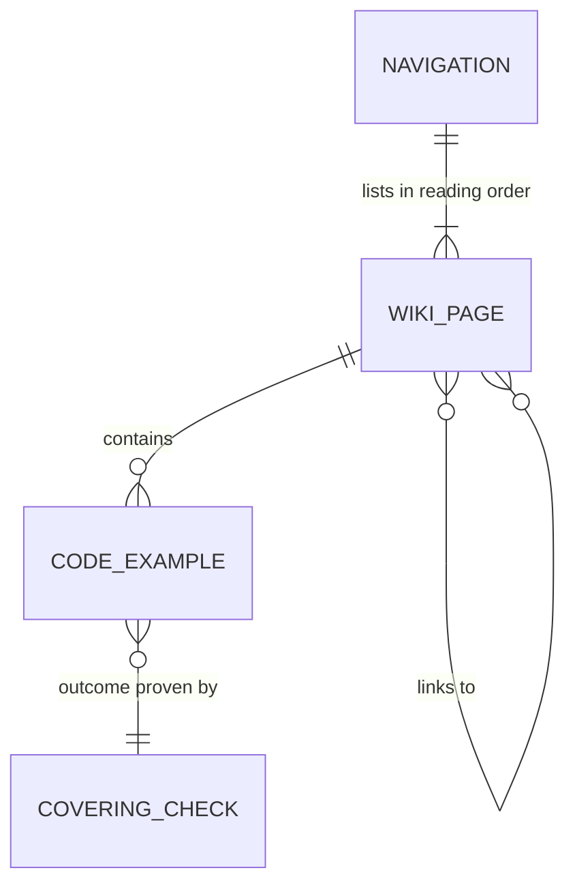

# Data Model: Groundhog GitHub Wiki Documentation

The "data" of this feature is the set of wiki pages, the code examples inside them and the
navigation that ties them together. All live as Markdown files in `wiki/` (research R1).

## Wiki page

| Field | Rule |
|---|---|
| File | `wiki/<Slug>.md`; slug = title with spaces replaced by `-`; ASCII letters, digits and `-` only; unique |
| Title | The file name, which GitHub renders as the page title (slug with `-` read as spaces); the page has no `#` heading of its own and starts with its lead |
| Group | One of Start, Guide, Reference, Contributing ([page-map](contracts/page-map.md)) |
| Order | Position in `_Sidebar.md`; equals the order of the page map |
| Lead | First paragraph says what the page covers and who needs it (≤ 3 sentences) |
| Sections | `##` headings, one per task or topic; headings are stable because other pages link to their anchors |
| Links | Relative `[text](Slug)` or `[text](Slug#anchor)` to wiki pages; absolute URLs to repository files |
| Next | Guide pages end with a "Next:" link to the following page in reading order |

Validation:
- Every page appears exactly once in `_Sidebar.md` and in the Home page's contents (SC-004).
- Every relative link resolves to a file in `wiki/` and, if it has an anchor, to a heading on that
  page (FR-013).
- No page contains placeholder text (`TODO`, `TBD`, `…` standing in for content) (Constitution V).

## Code example

| Field | Rule |
|---|---|
| Page and section | Where it appears |
| Starting data | Stated in prose or earlier on the page: which records exist, and the assumed "now" when the result depends on it (research R8) |
| Code | Fenced `php` or `bash` block using the running domain (`Meeting`, `Shift`) (FR-006) |
| Stated outcome | Trailing comment `// => …` or a "Result:" sentence; concrete values, not "it works" |
| Covering check | The automated test (file and test name) or quickstart validation step that proves the outcome ([example-coverage](contracts/example-coverage.md)) |

Validation:
- Every stated outcome has a covering check (FR-007, SC-003).
- Examples that change data say whether later examples on the page start from the changed state.

## Navigation

| Element | Content |
|---|---|
| `Home.md` | Overview (FR-001) followed by a contents list linking every page, grouped as in the page map (FR-002) |
| `_Sidebar.md` | Every page in reading order, grouped under Start / Guide / Reference / Contributing headings (FR-012) |
| `_Footer.md` | Version described ("dev-master, unreleased" until the first tag), links to the repository, README and CHANGELOG (FR-016, FR-017) |

## Lifecycle

```mermaid
stateDiagram-v2
    [*] --> Draft: page written in wiki/
    Draft --> Verified: every example traced to a passing check; links resolve
    Verified --> Published: maintainer procedure copies wiki/ to the wiki repository
    Published --> Draft: package behaviour or API changes (traced test changes)
```

