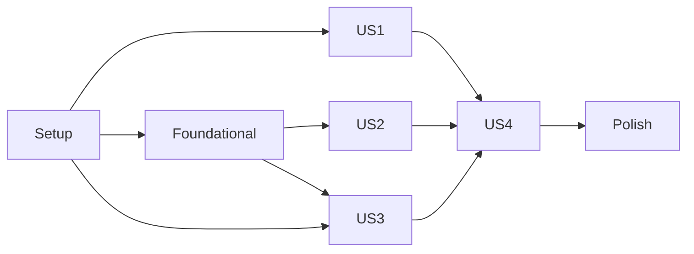

---

description: "Task list for Groundhog GitHub Wiki Documentation"
---

# Tasks: Groundhog GitHub Wiki Documentation

**Input**: Design documents from `/specs/002-github-wiki-docs/`

**Prerequisites**: [plan.md](plan.md), [spec.md](spec.md), [research.md](research.md), [data-model.md](data-model.md), [contracts/page-map.md](contracts/page-map.md), [contracts/example-coverage.md](contracts/example-coverage.md), [quickstart.md](quickstart.md)

**Tests**: The six **NEW** tests from [contracts/example-coverage.md](contracts/example-coverage.md) are required (FR-007, SC-003). They pin existing behaviour that pages will describe, so they pass on first run; nothing else in this feature changes behaviour. All other stated outcomes are proven by existing tests.

**Organization**: Tasks are grouped by user story (US1 Overview + Quick Start, US2 Usage guide, US3 Reference, US4 Publish and maintain).

## Format: `[ID] [P?] [Story] Description`

- **[P]**: Can run in parallel (different files, no dependencies on incomplete tasks)
- **[Story]**: User story the task belongs to (US1–US4)

## Writing rules for every page task

These apply to every `wiki/*.md` task; [data-model.md](data-model.md) is authoritative.

- **File and title**: file `wiki/<Slug>.md`, where the slug is the title with spaces replaced by `-` ("ASCII letters, digits and `-` only; unique"). GitHub renders the file name as the page title, so the page has no `#` heading and starts with its lead (found at T030: a `# <Title>` line showed the title twice).
- **Lead**: the first paragraph says what the page covers and who needs it ("≤ 3 sentences").
- **Sections**: `##` headings exactly as listed in [page-map.md](contracts/page-map.md), because other pages link to their anchors.
- **Links**: relative `[text](Slug)` or `[text](Slug#anchor)` between wiki pages; absolute `https://github.com/boysfromthefactory/groundhog/blob/master/<path>` for repository files (research R2).
- **Running domain** (research R9): `Meeting` (`title`, `location`, `capacity`, `room_id`, `starts_at`, `ends_at`, timestamps, soft deletes), and `Shift` (`label`, `starts_at`, no end column) when a model without an end is needed. The reference series is a weekly Monday stand-up from 2026-03-02 09:00–10:00, title "Standup", location "Room A". Its March occurrences are 2, 9, 16, 23 and 30 March.
- **Clock**: every outcome that depends on "now" states the assumed date: 1 March 2026 (research R8).
- **Outcomes**: shown as a trailing `// => …` comment or a "Result:" sentence with concrete values. Each must match the check named for it in [example-coverage.md](contracts/example-coverage.md).
- **Navigation**: guide pages end with `Next: [<next page>](<Slug>)` in reading order.
- **No placeholders**: no `TODO`, no `TBD`, no `…` standing in for content (Constitution V).

---

## Phase 1: Setup

**Purpose**: Create the source directory, keep it out of the package, and add the shared navigation.

- [X] T001 Create the `wiki/` directory at the repository root and add the line `/wiki               export-ignore` to `.gitattributes` after the existing `/workbench` entry, so wiki sources never ship in the installed package (FR-014, research R1).
- [X] T002 [P] Write `wiki/_Sidebar.md`: four bold group headings **Start**, **Guide**, **Reference**, **Contributing**, each followed by a bullet list of relative links to the pages of that group, in the page-map order (Home, Quick Start / Declaring Recurring Models … Identifying Occurrences / Configuration, Errors, Limitations, How It Works / Maintaining the Wiki). Use exactly the 16 slugs from [page-map.md](contracts/page-map.md) (FR-012).
- [X] T003 [P] Write `wiki/_Footer.md` with one line: "Documents Groundhog `dev-master` (unreleased) · [Repository](https://github.com/boysfromthefactory/groundhog) · [README](https://github.com/boysfromthefactory/groundhog/blob/master/README.md) · [Changelog](https://github.com/boysfromthefactory/groundhog/blob/master/CHANGELOG.md)" (FR-016, research R7).

---

## Phase 2: Foundational (Blocking Prerequisites)

**Purpose**: Pin the six documented outcomes that no existing test proves, so the pages can state them (research R3). Each test uses the existing helpers in `tests/Pest.php` (`mondaySeries()`, `march()`, `occurrenceOn()`, `startsOf()`) and the frozen "now" of 2026-03-01 from `tests/TestCase.php`.

**⚠️ CRITICAL**: Guide and reference pages that cite a **NEW** row must not be written before its test passes.

- [X] T004 [P] Add `it('exposes the stored rule row through recurrence()')` to `tests/Feature/RecurrenceRuleCastTest.php`. With `$series = mondaySeries()`, `$series->recurrence` is a `BoysFromTheFactory\Groundhog\Models\Recurrence` whose `rule` is `"DTSTART:20260302T090000Z\nRRULE:FREQ=WEEKLY;BYDAY=MO"`, whose `timezone` is `'UTC'` and whose `is_infinite` is `true`. After `$series->update(['recurrence_rule' => null])`, `Meeting::find($series->id)->recurrence` is `null`.
- [X] T005 [P] Add `it('persists an exception through decrement() on a virtual occurrence')` to `tests/Feature/EditOccurrenceTest.php`. With `$series = mondaySeries(['capacity' => 10])`, calling `occurrenceOn('2026-03-23')->decrement('capacity', 2)` makes `occurrenceOn('2026-03-23')` stored (`exists === true`) with `capacity === 8`. The series row's capacity is still 10 (`DB::table('meetings')->find($series->id)->capacity`), and `groundhog_exclusions` has 1 row.
- [X] T006 [P] Add `it('resolves the identity of a cursor-loaded exception on first use')` to `tests/Feature/EditOccurrenceTest.php`. Create the series, then save the 16 March occurrence as an exception. Load it with `Meeting::withoutOccurrences()->where('title', 'Standup')->cursor()->first(fn ($m) => $m->id === $exceptionId)` and assert:
  - before any predicate, `groundhog_series_key` is not in `getAttributes()`;
  - `isOccurrenceException()` returns `true`;
  - afterwards `toArray()['groundhog_series_key']` equals the series id.
- [X] T007 [P] Add `it('finds a virtual occurrence in a collection by the occurrence itself')` to `tests/Feature/PaginationAndAggregatesTest.php`, using that file's `beforeEach` data. Take `$all = daysOneToFive()->get()` and `$target = $all->first(fn (Meeting $m) => ! $m->exists && $m->title === 'Bravo' && $m->starts_at->format('d') === '04')`. Then `$all->find($target)` returns a model with `title === 'Bravo'` whose start is `2026-03-04 12:00`.
- [X] T008 [P] Add `it('finds an occurrence again by series key and original start')` to `tests/Feature/QueryOccurrencesTest.php`. With `$series = mondaySeries()`, `Meeting::where('groundhog_series_key', $series->id)->where('groundhog_original_starts_at', '2026-03-16 09:00:00')->sole()` is virtual (`exists === false`) and starts at `2026-03-16 09:00`. After that occurrence is saved as an exception with location "Room B", the same query returns the stored exception with location "Room B".
- [X] T009 [P] Add `it('excludes a key from stored rows with whereKeyNot()')` to `tests/Feature/EdgeCasesTest.php`. With `$series = mondaySeries()` and a plain meeting `$plain` ("Review", 2026-03-11 14:00–15:00), `Meeting::whereKeyNot($plain->id)->get()->modelKeys()` is `[$series->id]`: stored rows only, no virtual rows.
- [X] T010 Run `vendor/bin/pest` on sqlite, then `DB_CONNECTION=mysql DB_HOST=127.0.0.1 DB_DATABASE=groundhog DB_USERNAME=root vendor/bin/pest` and `DB_CONNECTION=pgsql DB_HOST=127.0.0.1 DB_PORT=5432 DB_DATABASE=groundhog DB_USERNAME=root vendor/bin/pest`. Then run `composer format` and `composer analyse`. Depends on T004–T009.
  - **All green**: the documented behaviour holds.
  - **Any new test fails**: stop and report the defect separately (spec Assumptions: no behaviour changes in this feature).

**Checkpoint**: Every row of [example-coverage.md](contracts/example-coverage.md) now names a passing check.

---

## Phase 3: User Story 1 - Understand the package and get a first result (Priority: P1) 🎯 MVP

**Goal**: A newcomer understands what Groundhog does and gets a paginated list of occurrences, edits one and cancels one, using only Home and Quick Start.

**Independent Test**: Quickstart V-3 (fresh Laravel 13 application, under 15 minutes) and the Home-only questions from spec US1 acceptance scenario 1.

- [X] T011 [P] [US1] Write `wiki/Home.md` per page-map row 1 (FR-001, FR-002).
  - **Opening**: "Groundhog makes Eloquent models recurring: add one trait, attach an RFC 5545 rule to a record, and every ordinary query returns one model instance per occurrence."
  - **Problem**: storing one row per occurrence is wasteful and hard to change; computing occurrences in PHP breaks pagination and query constraints.
  - **When to use**: e.g. meetings, shifts, classes, reminders that repeat, where single occurrences may move or be cancelled.
  - **When not to use**: "this and following occurrences" edits, RDATE/EXDATE, iCalendar import/export, SQL Server, cursor pagination; link to [Limitations](Limitations).
  - **Supported platforms**: PHP 8.4+, Laravel 13, SQLite 3.35+, MySQL 8.4, PostgreSQL 14+.
  - **`## Core concepts`**: a definition list for recurring model, series, recurrence rule, occurrence (virtual occurrence), exception, cancellation and horizon. Reuse the definitions from `specs/001-recurring-eloquent-models/spec.md` § Glossary in plain words.
  - **`## Contents`**: links to all 16 pages, grouped as in the sidebar.
- [X] T012 [P] [US1] Write `wiki/Quick-Start.md` per page-map row 2 (FR-003). Each numbered `##` step has code and its outcome.
  1. **Install**: `composer require boysfromthefactory/groundhog`, followed by a "Before the first tagged release" note with the `composer.json` snippet `"repositories": [{"type": "vcs", "url": "https://github.com/boysfromthefactory/groundhog"}]` and `composer require boysfromthefactory/groundhog:dev-master`. No credentials are needed; the repository is public (research R4).
  2. **Publish and migrate**: `php artisan vendor:publish --tag="groundhog-migrations"` and `php artisan migrate`. Optionally publish the config with `--tag="groundhog-config"`. Result: tables `groundhog_recurrences`, `groundhog_occurrences`, `groundhog_exclusions`.
  3. **Add `HasRecurrence`** to an existing `Meeting` model (`starts_at`/`ends_at` columns, `$fillable` including `recurrence_rule`). Show the full class with namespaces.
  4. **Create the series**: `Meeting::create(['title' => 'Standup', 'location' => 'Room A', 'starts_at' => '2026-03-02 09:00', 'ends_at' => '2026-03-02 10:00', 'recurrence_rule' => 'FREQ=WEEKLY;BYDAY=MO'])`.
  5. **Query March**: `Meeting::whereBetween('starts_at', ['2026-03-01', '2026-03-31 23:59:59'])->orderBy('starts_at')->paginate(25)`. Result: 5 items starting 2, 9, 16, 23 and 30 March at 09:00, each ending at 10:00, `exists === false`.
  6. **Edit 16 March**: find it in the results and set `location = 'Room B'`, then `save()`. Result: stored as an exception; the other occurrences are unchanged.
  7. **Cancel 23 March**: `->delete()`. Result: no record stored; the occurrence disappears.
  8. **Re-run the query**. Result: 2 (Room A), 9 (Room A), 16 (Room B, stored), 30 (Room A).
  9. **`## Where next`**: links to the guide pages.

  Checks: Query › US1-1; Edit › US3-1/US3-2; Life › US4-1 ([example-coverage](contracts/example-coverage.md)).
- [X] T013 [US1] Run quickstart V-3. In `$HOME/.cache/groundhog-v3/`, create a Laravel 13 app (`composer create-project laravel/laravel app`) using SQLite. Add a Composer `path` repository pointing at the package checkout, then follow `wiki/Quick-Start.md` verbatim, creating the `meetings` migration it implies. Record the elapsed time and any deviation; fix the page until every stated outcome matches. Delete `$HOME/.cache/groundhog-v3/` afterwards. Depends on T012.

**Checkpoint**: The MVP: Home and Quick Start are verified end to end.

---

## Phase 4: User Story 2 - Accomplish a specific task from the usage guide (Priority: P1)

**Goal**: Each public capability has a task-oriented guide section with a verified example.

**Independent Test**: For every row of [example-coverage.md](contracts/example-coverage.md) whose page is a guide page, the section exists and its example states the outcome the named test proves.

- [X] T014 [P] [US2] Write `wiki/Declaring-Recurring-Models.md` with the page-map row 3 sections:
  - **Adding the trait**: full `Meeting` class.
  - **Start and end columns**: constants for custom names.
  - **Models without an end**: `Shift` with `RECURRENCE_ENDS_AT = null`; occurrences carry only a start.
  - **Mass assignment**: `recurrence_rule` in `$fillable`; `$guarded = []` works as is.
  - **Soft deletes**: `use SoftDeletes` alongside the trait; behaviour linked to [Managing a Series](Managing-a-Series).
  - **Custom Eloquent builders**: `#[UseEloquentBuilder(MyBuilder::class)]` where `MyBuilder extends RecurringBuilder`; a plain builder throws `IncompatibleEloquentBuilder`.

  Checks: coverage rows "Trait and model", lines 1–4.
- [X] T015 [P] [US2] Write `wiki/Recurrence-Rules.md` with the page-map row 4 sections:
  - **Assigning a rule**: RRULE string; string with a `DTSTART;TZID=Europe/Budapest:…` line; parts array `['FREQ' => 'WEEKLY', 'BYDAY' => 'MO']`; `new RRule([...])`. All give the same March occurrences.
  - **Time zones and daylight saving**: the stored zone comes from DTSTART; 09:00 Budapest holds before and after 29 March.
  - **Supported RRULE parts**: list all 14 RRULE parts; EXDATE, RDATE and EXRULE throw `InvalidRecurrenceRule`.
  - **Validation errors**: `FREQ=WEEKLY;BYDAY=XX` throws on assignment; the message names BYDAY; nothing is stored.
  - **Reading the rule**: `$meeting->recurrence_rule->humanReadable()` starts "weekly on Monday"; `getOccurrencesBetween()`. On a virtual occurrence it is the series' rule; on an exception it is `null`; it reflects the rule only.
  - **Replacing and removing a rule**.
  - **The stored rule**: `$meeting->recurrence` (`Recurrence` model, RFC text, zone, `is_infinite`), for reading only.

  Checks: the matching coverage rows, including T004.
- [X] T016 [P] [US2] Write `wiki/Querying-Occurrences.md` with the page-map row 5 sections:
  - **What a query returns**: occurrences, plain records and exceptions; series rows absent.
  - **Time windows**: `whereBetween`; `where('ends_at', '>', …)` returns running occurrences.
  - **Non-time constraints**: `where('location', 'Room A')`.
  - **Open-ended rules and the horizon**, assuming now = 2026-03-01: an unconstrained daily rule gives 365 rows ending 28 Feb 2027; `where('starts_at', '>=', '2030-01-01')` gives 365 rows ending 31 Dec 2030. Link to [Configuration#horizon](Configuration#horizon).
  - **Occurrence attributes and predicates**: `isVirtualOccurrence()`, `getKey() === null`, `originalOccurrenceStart()`, `series`.
  - **Relationships**:
    - `with('room')` loads the room;
    - `with('attendees')` is empty on occurrences;
    - `with('series')`;
    - `Room::whereHas('meetings', …)`, `$room->meetings()`, joins with `select('meetings.*')`;
    - `$attendee->meeting` resolves to the stored series.
  - **Multiple recurring models**: `Meeting` and `Shift` never mix.

  Checks: coverage rows under "Builder and queries" for page Querying.
- [X] T017 [P] [US2] Write `wiki/Pagination-and-Collections.md` with the page-map row 6 sections. Use the US2 data from `PaginationAndAggregatesTest`: Alpha daily 08:00, Bravo daily 12:00, Charlie plain on 4 March 10:00, over 2–6 March, 11 rows.
  - **Pagination**: `paginate(4, page: 2)` gives items 5–8 (Alpha 04 08:00, Charlie 04 10:00, Bravo 04 12:00, Alpha 05 08:00) with total 11. `simplePaginate`.
  - **Counting, existence and aggregates**: `count`, `exists`, `min`, `max`, `sum`, `avg`.
  - **Ordering and ties**: stable tie-breakers when the query orders by something; grouped and distinct queries keep the caller's order.
  - **Chunking and lazy iteration**: `chunk`, `lazy` and `cursor` visit every occurrence once; `chunkById` throws `RecurrenceNotSupported` unless `withoutOccurrences()`.
  - **Collections**: `unique`, `merge`, `diff`, `intersect`, and `find($occurrence)` (T007).
  - **Selecting columns, grouping and distinct**: identity columns are kept on explicit selects; per-location counts with `havingRaw`.

  Checks: coverage rows for page Pagination.
- [X] T018 [P] [US2] Write `wiki/Editing-Occurrences.md` with the page-map row 7 sections:
  - **Saving an edited occurrence**: 16 March, Room B.
  - **`update()`, `increment()`, `decrement()`**: uses T005.
  - **Moving an occurrence**: to 18 March 14:00.
  - **Editing an exception again**: updated in place.
  - **Saving without changes**: still stored.
  - **Events**: promotion fires `saving`, `creating`, `created`, `saved`; an edit fires `saving`, `updating`, `updated`, `saved`.
  - **Concurrent edits of the same occurrence**: the second save throws `QueryException` and leaves no orphan row.
  - **Rules on exceptions are rejected**: `RecurrenceNotSupported`.

  Checks: coverage rows for page Editing.
- [X] T019 [P] [US2] Write `wiki/Cancelling-Occurrences.md` with the page-map row 8 sections:
  - **Cancelling an occurrence**: `delete()`; fires `deleting`/`deleted`; nothing stored.
  - **Vetoing with a `deleting` listener**: returning `false` keeps the occurrence.
  - **Deleting an exception**: `forceDelete()` keeps the occurrence cancelled; a model without soft deletes behaves the same on `delete()`.
  - **Restoring a soft-deleted exception**: cancelled while trashed, back on `restore()`.

  Checks: coverage rows for page Cancelling.
- [X] T020 [P] [US2] Write `wiki/Managing-a-Series.md` with the page-map row 9 sections:
  - **Editing series attributes**: the title propagates to occurrences; exceptions keep theirs.
  - **Changing the rule or the start**:
    - a Tuesday rule gives 3, 10, 17, 24 and 31 March plus the former 16 March exception as a plain record;
    - a start of 10:00 detaches exceptions in the same way and brings back 23 March at 10:00 (cancellation discarded).
  - **Changing only the duration**: ends move; exceptions and cancellations stay.
  - **Re-assigning the same rule**: nothing changes.
  - **Removing the rule**.
  - **Deleting a series**: `forceDelete()` removes the rule, occurrences and exceptions, including trashed ones; `Shift::destroy()` for models without soft deletes.
  - **Soft deleting and restoring a series**.

  Checks: coverage rows for page Series.
- [X] T021 [P] [US2] Write `wiki/Stored-Records-and-Bulk-Writes.md` with the page-map row 10 sections:
  - **Looking up by key**: `find`, `whereKey`, `whereKeyNot` (T009), `destroy`, and belongs-to relations pointing at the model; any query that pins the primary key reads stored rows.
  - **Route model binding**: `Route::get('/meetings/{meeting}', …)` binds the stored series.
  - **`withoutOccurrences()`**.
  - **Query-level writes**: `Meeting::where('title', 'Standup')->update([...])`, `delete`, `forceDelete`, `increment`, `decrement`, `incrementEach`, `decrementEach`, `touch`, `insert`, `insertGetId`, `insertOrIgnore`, `upsert`. These act on stored rows only and never create exceptions or cancellations. Warn that bulk-deleting series rows bypasses their cleanup.
  - **Roles of stored records**: `isRecurringSeries()`, `isOccurrenceException()`.

  Checks: coverage rows for page Stored records.
- [X] T022 [P] [US2] Write `wiki/Identifying-Occurrences.md` with the page-map row 11 sections:
  - **The identity attributes**: `groundhog_series_key`, `groundhog_original_starts_at`; `null` for plain records.
  - **In JSON / `toArray()`**: example JSON of a virtual occurrence.
  - **Finding an occurrence again from its identity**: query by both attributes (T008).
  - **Editing an occurrence from a form or API request**: a controller receives `series_key` and `original_starts_at`, finds the occurrence with the T008 query, then calls `update($validated)`; works for virtual occurrences and exceptions alike.
  - **Stored rows streamed with `cursor()`**: identity is resolved on first use (T006).

  Checks: coverage rows for page Identifying.
- [X] T023 [US2] Review pass over the guide pages from T014–T022. Every example that states an outcome must appear in [example-coverage.md](contracts/example-coverage.md) with the same values; add any missing row together with its check (an existing test or a new one, as in Phase 2). Every guide page must end with its "Next:" link. Depends on T014–T022.

**Checkpoint**: The usage guide is complete and every stated outcome is traced.

---

## Phase 5: User Story 3 - Look up configuration, errors and limitations (Priority: P2)

**Goal**: Reference pages give cause, effect and remedy for every option, error and limitation.

**Independent Test**: Quickstart V-7: each exception class and each limitation is reachable from Home in at most two clicks, with cause and remedy.

- [X] T024 [P] [US3] Write `wiki/Configuration.md` per page-map row 12 (FR-008).
  - **Publishing the config**: `php artisan vendor:publish --tag="groundhog-config"`.
  - **`## horizon`**: ISO-8601 duration string, default `'P1Y'`. Applies only to rules without COUNT/UNTIL when the query has no upper bound; measured from the lower start bound, or from now. Example: `config(['groundhog.horizon' => 'P1M'])` makes the unconstrained daily series count 31 at now = 2026-03-01.
  - **`## max_occurrences_per_series`**: int, default `50000`. Limits one generation pass for one series: a minutely rule is rejected on save; a far query throws.
  - **`## max_materialization_ahead`**: ISO-8601 duration, default `'P10Y'`. How far ahead of now a read may extend the stored index; applies only when generation is needed.

  Checks: coverage rows under "Configuration and errors".
- [X] T025 [P] [US3] Write `wiki/Errors.md` per page-map row 13 (FR-009). One `##` per class, each giving its parent class, each cause with an example trigger and an approximate message, and the fix.
  - **`InvalidRecurrenceRule`** (`InvalidArgumentException`): malformed or unsupported part; EXDATE/RDATE/EXRULE lines.
  - **`RecurrenceNotSupported`** (`LogicException`): rule assigned to an exception or occurrence; series saved without a start; `chunkById`/`lazyById`/`eachById` while expanded.
  - **`OccurrenceLimitExceeded`** (`RuntimeException`): one pass over `max_occurrences_per_series`; a read beyond `max_materialization_ahead`.
  - **`IncompatibleEloquentBuilder`** (`LogicException`): custom builder not extending `RecurringBuilder`.

  Take the message texts from `src/Exceptions/*.php`. Checks: coverage rows naming each error.
- [X] T026 [P] [US3] Write `wiki/Limitations.md` per page-map row 14 (FR-010). One `##` per limitation, each with its workaround, in the same order and meaning as the README "Caveats" section:
  1. key-based relations are empty on occurrences;
  2. `chunkById` family;
  3. `cursorPaginate` unsupported;
  4. SQL Server unsupported;
  5. occurrences cannot be queued by identity (pass the series key and original start instead);
  6. bulk deletes of series rows bypass cleanup;
  7. dense rules and the materialisation ceiling;
  8. `cursor()` identity;
  9. no "this and following" edits;
  10. no RDATE/EXDATE;
  11. no iCalendar import/export.
- [X] T027 [P] [US3] Write `wiki/How-It-Works.md` per page-map row 15 (FR-011).
  - **Expansion**: a derived table replaces the model's table under the same name, so SQL constraints, joins and pagination see occurrences as rows.
  - **The occurrence index**: filled on save up to now + horizon, extended lazily by reads.
  - **Exclusions**: exception links and cancellations.
  - **Limits**: horizon, per-series limit and ceiling.
  - **Key-pinned queries**: these read stored rows.
  - **Performance**: per database for 1,000 daily series over one year, a page of 25 with its total: PostgreSQL 0.33–0.65 s (budget 1 s), MySQL 8.4 0.95–1.11 s (budget 2 s), SQLite 0.14–2.01 s (budget 3 s, last page slowest). Narrow time bounds make queries faster.

  Take the figures from `specs/001-recurring-eloquent-models/spec.md` § Implementation amendment.

**Checkpoint**: The reference pages are complete.

---

## Phase 6: User Story 4 - Publish and maintain the wiki (Priority: P3)

**Goal**: The pages are published to the GitHub wiki with working navigation, and maintainers can repeat the publication.

**Independent Test**: Quickstart V-5: publish into the wiki, and every sidebar and Home link works; republishing after an edit changes only that page.

- [X] T028 [US4] Write `wiki/Maintaining-the-Wiki.md` per page-map row 16 (FR-014, FR-015, FR-016). Cover:
  - where the sources live (`wiki/`, excluded from the package);
  - the writing rules (the "Writing rules" list at the top of this file, in reader terms);
  - first publication (wiki enabled and first page created; already done for this repository);
  - publishing an update, as Bash:
    ```bash
    git clone git@github.com:boysfromthefactory/groundhog.wiki.git /tmp/groundhog.wiki
    rsync -av --delete --exclude .git wiki/ /tmp/groundhog.wiki/
    cd /tmp/groundhog.wiki
    git add -A
    git commit -m "docs: sync from groundhog@<sha>"
    git push
    ```
  - on each release, changing `_Footer.md` from `dev-master` to the tag.
- [X] T029 [US4] Run quickstart V-1 and V-2 on `wiki/`:
  - every page is listed in `wiki/Home.md` and `wiki/_Sidebar.md`;
  - every relative link and anchor resolves to a file and heading in `wiki/`;
  - there are no `TODO`, `TBD` or `NEEDS CLARIFICATION` strings.

  Fix every finding. Depends on T002, T003, T011, T012, T014–T022, T024–T028.
- [X] T030 [US4] Publish (quickstart V-5) by following `wiki/Maintaining-the-Wiki.md` exactly, cloning into a temporary directory under `$HOME/.cache/`. Replace the placeholder `Home.md` and push. Then verify through the GitHub web UI or `gh browse --wiki` that the sidebar and footer render, and that every Home and sidebar link opens its page. Delete the temporary clone. Depends on T029.

**Checkpoint**: The wiki is live.

---

## Phase 7: Polish & Cross-Cutting Concerns

- [X] T031 [P] In `README.md`, add a `## Documentation` section after the opening paragraph: "The full guide, with examples for every feature, is in the [wiki](https://github.com/boysfromthefactory/groundhog/wiki): [Quick Start](https://github.com/boysfromthefactory/groundhog/wiki/Quick-Start) · [Usage guide](https://github.com/boysfromthefactory/groundhog/wiki/Declaring-Recurring-Models) · [Configuration](https://github.com/boysfromthefactory/groundhog/wiki/Configuration) · [Errors](https://github.com/boysfromthefactory/groundhog/wiki/Errors) · [Limitations](https://github.com/boysfromthefactory/groundhog/wiki/Limitations)" (FR-017).
- [X] T032 [P] In `CHANGELOG.md`, add under `## Unreleased` a `### Documentation` subsection: "GitHub wiki with an overview, quick start, usage guide for every feature, configuration, error and limitation reference, and maintainer publishing guide." (Constitution V).
- [X] T033 Run quickstart V-6: compare `wiki/Limitations.md`, `wiki/Configuration.md` and `wiki/Quick-Start.md` with the README's Caveats, configuration and installation sections and the CHANGELOG; resolve every contradiction in the wiki, or in the README when the README is wrong. Then run V-7: from Home, reach each exception class and limitation in at most two clicks. Depends on T026, T031, T032.
- [X] T034 Run quickstart V-4: the full suite on sqlite, mysql and pgsql (commands as in T010), then `composer format -- --test` and `composer analyse`. If T023 or T033 changed any page, republish with the T030 procedure.
- [X] T035 Commit with Conventional Commits:
  - `test: pin documented behaviour for the wiki (002)` for T004–T009;
  - `docs: add GitHub wiki sources (002)` for `wiki/`, `.gitattributes`, `README.md`, `CHANGELOG.md` and `specs/002-github-wiki-docs/`.

  Then push to `origin master`.

---

## Dependencies & Execution Order

### Phase Dependencies

- **Setup (Phase 1)**: none.
- **Foundational (Phase 2)**: none; blocks every page that cites a **NEW** row (T015, T017, T018, T021, T022, T026).
- **US1 (Phase 3)**: depends on Setup. It can run in parallel with Phase 2 because Home and Quick Start cite no **NEW** row.
- **US2 (Phase 4)**: depends on Setup and Foundational.
- **US3 (Phase 5)**: depends on Setup; T026 also depends on T006.
- **US4 (Phase 6)**: depends on US1–US3 (it publishes all pages).
- **Polish (Phase 7)**: T031/T032 can run any time; T033–T035 come last.



### Parallel Opportunities

- Setup: T002 and T003.
- Foundational: T004–T009 are in four different test files. T005 and T006 share `EditOccurrenceTest.php`; write them together or one after the other.
- US1: T011 and T012.
- US2: T014–T022 (one file each).
- US3: T024–T027.
- Polish: T031 and T032.

---

## Parallel Example: User Story 2

```bash
Task: "Write wiki/Declaring-Recurring-Models.md"
Task: "Write wiki/Recurrence-Rules.md"
Task: "Write wiki/Querying-Occurrences.md"
Task: "Write wiki/Pagination-and-Collections.md"
Task: "Write wiki/Editing-Occurrences.md"
Task: "Write wiki/Cancelling-Occurrences.md"
Task: "Write wiki/Managing-a-Series.md"
Task: "Write wiki/Stored-Records-and-Bulk-Writes.md"
Task: "Write wiki/Identifying-Occurrences.md"
```

---

## Implementation Strategy

### MVP First (User Story 1)

1. Phase 1 Setup.
2. Phase 3: Home and Quick Start, verified in a fresh application (T013).
3. **Stop and validate**: a newcomer reaches a first result from the wiki sources.

### Incremental Delivery

1. Setup + Foundational → the documented behaviour is pinned.
2. US1 → overview and first result.
3. US2 → task guide.
4. US3 → reference.
5. US4 → published wiki.
6. Polish → README link, CHANGELOG, consistency check, commit.

---

## Notes

- [P] = different files, no dependency on incomplete tasks.
- A page task is done only when every outcome it states matches its coverage check.
- Any package defect found while checking examples is reported, not fixed, in this feature (spec Assumptions).
